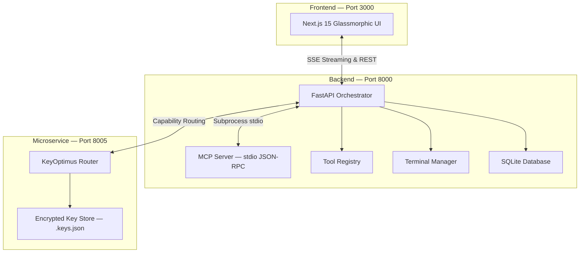
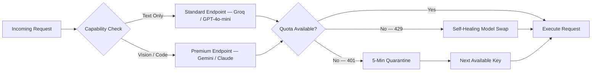
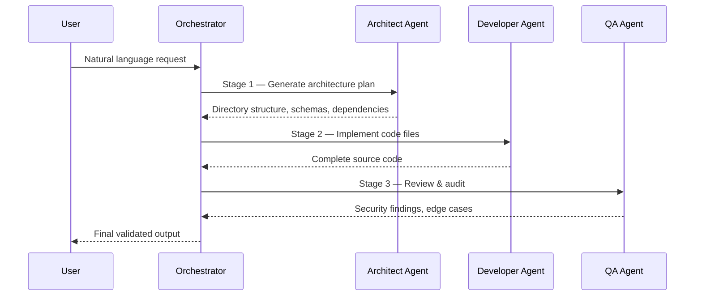
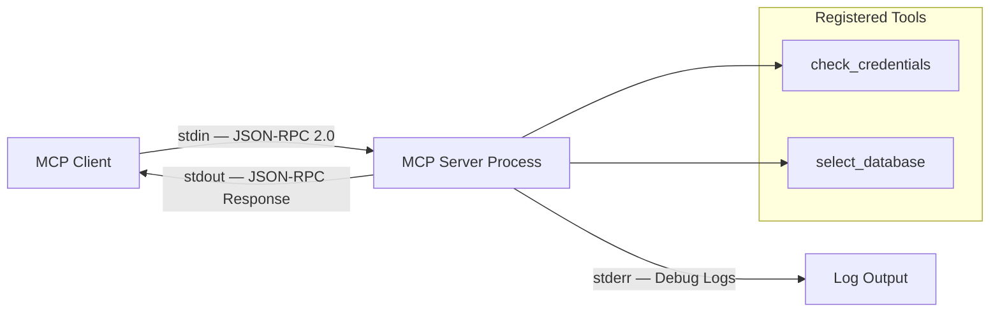
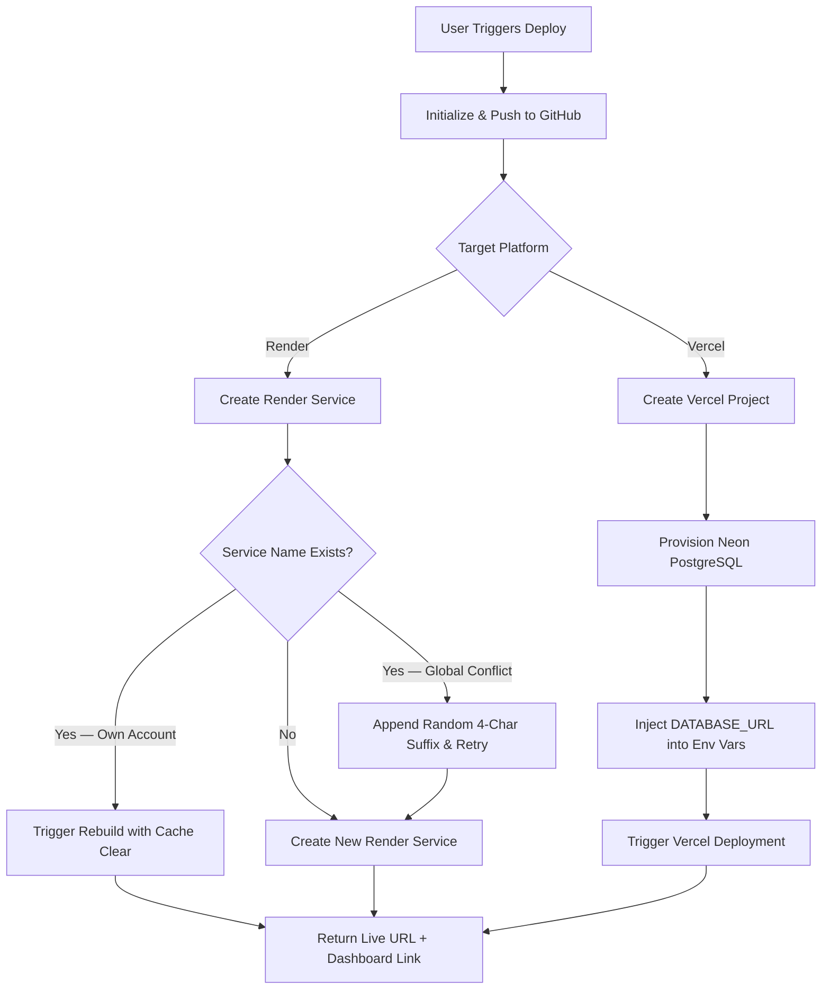
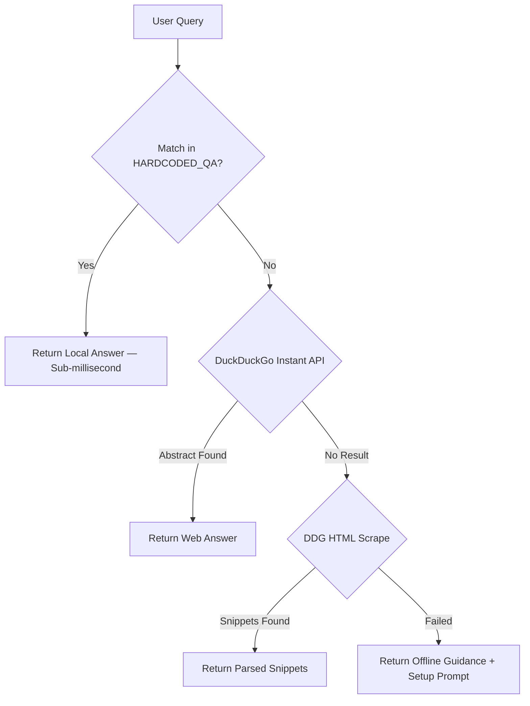
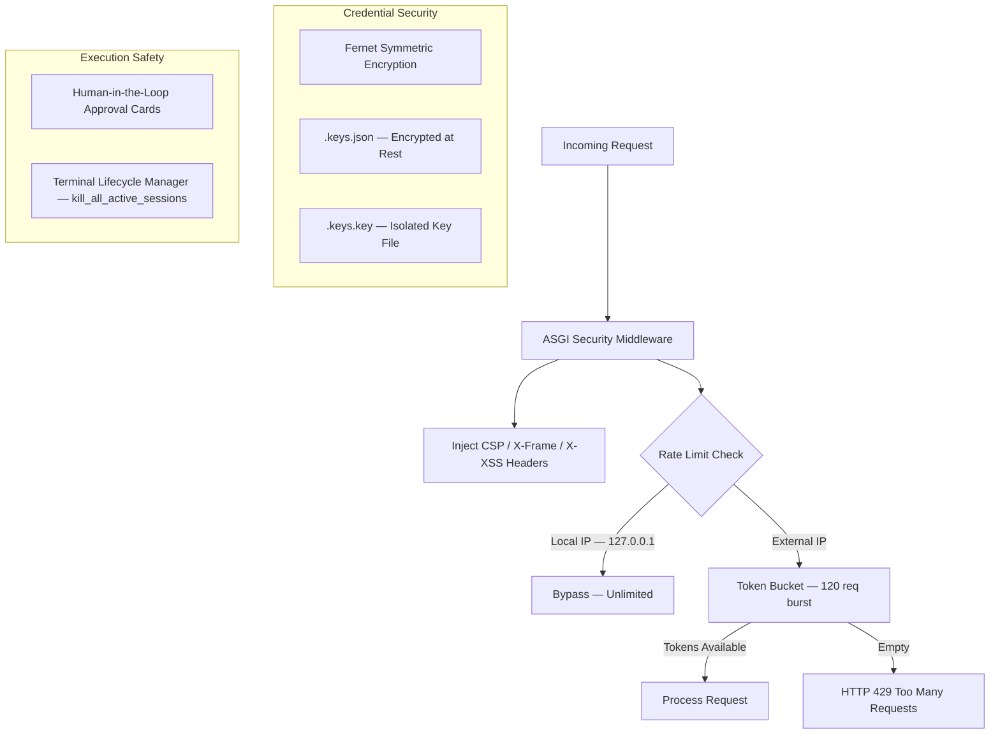

# DevOps Concierge Agent

## 1. Executive Summary

The **DevOps Concierge Agent** is an enterprise-grade AI automation platform that functions as an autonomous virtual staff engineer. It enables developers to scaffold full-stack applications, auto-provision cloud infrastructure, manage databases, execute secure terminal sessions, and generate consulting-grade documentation — all through natural language interaction.

The platform combines a **Next.js 15** glassmorphic frontend with a **FastAPI** backend and a dedicated **KeyOptimus** microservice, orchestrating multi-agent workflows while enforcing human-in-the-loop security at every critical step. It implements the **Model Context Protocol (MCP)** via a custom stdio-based JSON-RPC 2.0 server and maintains an **8,400+ entry offline QA database** for zero-latency, zero-cost local answers.

---

## 2. The Problem: The DevOps Gap in AI

General-purpose LLMs generate code snippets effectively but fail at end-to-end execution due to three fundamental constraints:

| Constraint | Impact on DevOps Automation |
|---|---|
| **No Environment Context** | Models cannot see host directories, active shells, or local file trees |
| **Key Exhaustion & Rate Limits** | High-frequency API calls trigger HTTP 429 errors, halting multi-step agent operations |
| **Execution Safety Risk** | Unrestricted terminal and filesystem access risks data corruption and command injection |

The DevOps Concierge Agent addresses all three through a purpose-built secure containment architecture: human-in-the-loop approval gates ensure no destructive operation executes without explicit user consent, intelligent rate-limit routing via KeyOptimus distributes requests across multiple providers, and structured file validation verifies every write operation before it touches the filesystem.

---

## 3. System Architecture

The platform operates as three decoupled services communicating over localhost:



- **Next.js 15 Frontend (Port 3000):** Glassmorphic interface built with pure CSS featuring real-time agent status pills ("waiting", "active", "done"), human-in-the-loop approval cards (✓ Approve / ✕ Deny) for filesystem writes and shell commands, and a live settings panel for credential management and model selection.
- **FastAPI Backend (Port 8000):** The central orchestration engine managing async tool execution, streaming chat responses via SSE, maintaining conversation history in a local SQLite database, and coordinating the multi-agent pipeline. Protected by custom ASGI security middleware with CSP and rate limiting.
- **KeyOptimus Microservice (Port 8005):** A zero-AI-token service dedicated to API key orchestration — capability-aware routing, latency balancing, and self-healing model swapping across all configured LLM providers without consuming inference tokens.

---

## 4. KeyOptimus: API Key Router & Optimizer

Managing multiple LLM providers (Google Gemini, OpenAI, Anthropic, Groq, Hugging Face) simultaneously creates load-balancing challenges. KeyOptimus eliminates cascading failures by serving as a deterministic, self-healing routing manager.



The routing logic follows four core principles:

- **Capability-Aware Routing:** General text is routed to cheaper endpoints (Groq, GPT-4o-mini), reserving premium models (Gemini multimodal, Claude code synthesis) for complex tasks.
- **Utility Preservation:** When a premium key's remaining quota drops to ≤5 calls, it is locked out of text tasks and reserved for multimodal requests.
- **Self-Healing Model Swap:** On HTTP 429, KeyOptimus swaps to an alternative model on the same key (e.g., `gemini-2.5-flash` → `gemini-2.5-pro`).
- **Quarantine & Audit:** Keys returning HTTP 401 are quarantined for 5 minutes. All metadata is logged to `api_key_metrics.xlsx`.

---

## 5. Multi-Agent Orchestration Pipeline

When the orchestrator detects a complex DevOps task (e.g., "build me a full-stack e-commerce app with PostgreSQL"), it triggers a three-stage agent pipeline coordinated by `orchestrator.py`. Each stage uses specialized models optimized for its particular responsibility, and all stages include deterministic failover pools.



| Stage | Agent Role | Primary Models | Responsibility |
|---|---|---|---|
| **1 — Architect** | System Architect | Llama 3.3 70B / Gemini Pro | Analyzes the prompt and generates a detailed implementation plan specifying directory structures, system dependencies, database schemas, and API contracts |
| **2 — Developer** | Lead Developer | Qwen 2.5 Coder / Gemini Pro | Receives the architectural plan and implements complete, production-ready code files with proper formatting and error handling |
| **3 — QA** | QA Reviewer | Qwen 7B / Gemini Flash | Performs static code analysis, security auditing, and edge-case identification before presenting the final output to the user |

Each stage maintains a deterministic failover pool (`HF_STAGE_MODELS`) containing backup model endpoints on Hugging Face. If the primary model for any stage encounters an error or rate limit, the orchestrator automatically substitutes the next available model from the pool, ensuring the pipeline completes without manual intervention. This failover mechanism has been tested across all three stages to verify seamless model substitution during provider outages.

---

## 6. Custom Model Context Protocol (MCP) Server

The platform includes a built-in, zero-dependency MCP server at `backend/agent/mcp_server.py`. This server implements the open MCP specification, enabling standardized tool discovery and execution through a structured protocol rather than ad-hoc function calls.



The server uses **stdio-based transport** (`stdin`/`stdout`) with JSON-RPC 2.0 message framing. All debug logs and diagnostic output are written exclusively to `stderr`, ensuring the `stdout` channel remains clean for protocol messages. The server supports three core methods: `initialize` (handshake and capability negotiation), `tools/list` (returns the schema of all registered tools), and `tools/call` (executes a specific tool with provided arguments).

Two tools are currently registered. The `check_credentials` tool performs a security audit on all configured API keys (GitHub, Vercel, Render, Neon) and returns their configuration status without exposing actual secret values. The `select_database` tool analyzes a natural language project requirements description and recommends the optimal database engine using a keyword relevance scoring matrix, returning ranked suggestions with confidence scores.

---

## 7. Automated Cloud Provisioning

The agent handles full-stack deployments autonomously, managing the complete lifecycle from local code to live production URLs across GitHub, Vercel, and Render.



For Vercel deployments, the agent provisions a serverless Neon PostgreSQL database, retrieves the connection string, and automatically injects it as `DATABASE_URL` into the project's environment variables across Dev, Preview, and Production environments. For Render deployments, the agent implements intelligent collision avoidance: it queries the user's active services list to detect naming conflicts. If a service with the target name already exists under the user's account, it triggers a rebuild with cache clearance rather than failing. If the name is globally occupied by another Render tenant, the agent appends a random 4-character suffix and retries the creation. The frontend displays direct clickable URLs to both the live application and the Render deployment dashboard.

The DevOps Toolkit also features a **Vista-style native folder selection** dialog. Since browser security restrictions prevent web applications from capturing absolute system paths, the agent spawns a lightweight PowerShell subprocess that opens the Windows-native `System.Windows.Forms.OpenFileDialog`. This returns the selected absolute directory path to the frontend for use in deployment workflows.

---

## 8. Local-First Offline Knowledge System

The agent guarantees uninterrupted utility even without internet connectivity or configured API keys through a multi-layered fallback architecture.



The file `hardcoded_responses.py` contains a compiled dictionary (`HARDCODED_QA`) with over **8,428 unique question-answer mappings** covering fundamental web development and DevOps concepts including Docker, Kubernetes, Git, Next.js, React, FastAPI, Tailwind CSS, TypeScript, SQLite, and CI/CD best practices. Queries matching the local database are resolved in sub-milliseconds with zero API token consumption. For unmatched queries, the system executes `search_web_fallback`, which first queries DuckDuckGo's Instant Answer JSON API and then falls back to HTML scraping with regex-based title and snippet extraction. When all pathways fail, the response includes actionable guidance prompting users to configure a Gemini API key or install local Ollama models through the Settings panel.

The system also supports **local Ollama model management**. The Settings panel auto-discovers installed models at `localhost:11434`, distinguishing between text LLMs (Qwen 2.5 Coder) and vision models (LLaVA). Recommended models that are not yet installed are displayed with an "Auto-Install" option that triggers background downloads with real-time progress streaming. A **QLoRA fine-tuning pipeline** (`fine_tune.py`) enables further model customization on the `agent_training_data.jsonl` dataset using BFloat16 precision, optimized for consumer NVIDIA GPUs.

---

## 9. Security Engineering & Lifecycle Governance

The platform enforces a rigorous, multi-layered security model designed to protect both user data and system integrity throughout the agent's autonomous operation.



- **Encryption at Rest:** All API credentials are encrypted using Fernet symmetric cryptography before storage in `.keys.json`. The encryption key is isolated in a separate `.keys.key` file, ensuring that compromising one file alone does not expose secrets.
- **Human-in-the-Loop Gating:** Every sensitive operation — terminal command execution, filesystem writes, and cloud API calls — requires explicit user approval through interactive UI cards. Users see exactly what command or file write is proposed and can approve or deny with a single click.
- **Terminal Lifecycle Governance:** When a user resets or deletes a conversation, the system stops the streaming agent state machine and invokes `kill_all_active_sessions()`. This immediately terminates all background shell processes (running dev servers, compilers, build tools), preventing orphan processes from consuming CPU and memory.
- **ASGI Security Middleware:** The custom `SecurityAndRateLimitMiddleware` injects strict Content Security Policy headers, `X-Frame-Options: DENY` (anti-clickjacking), `X-Content-Type-Options: nosniff` (MIME-sniffing prevention), and `X-XSS-Protection` headers. External IPs are rate-limited via a token bucket algorithm (120-request burst, 2 tokens/second refill), while local loopback addresses bypass rate limiting.

---

## 10. Desktop Packaging & Distribution

A key design goal was ensuring the platform can be distributed as a standalone desktop application — no Python installation, no Node.js runtime, and no terminal commands required from the end user. The platform achieves this through two complementary distribution channels.

```mermaid
flowchart TD
    subgraph "Build Pipeline"
        NX[Next.js Static Export — output: export] --> OUT[/out/ directory]
        PY1[PyInstaller — backend/main.py] --> BE[backend-x86_64-pc-windows-msvc.exe — 108 MB]
        PY2[PyInstaller — backend/run_scheduler.py] --> SC[scheduler-x86_64-pc-windows-msvc.exe — 34 MB]
    end

    subgraph "Tauri v2 Bundle — com.devopsconcierge.app"
        OUT --> WEBVIEW[Tauri Webview — Renders UI from /out/]
        BE --> SIDECAR1[Sidecar: backend — Spawned on launch]
        SC --> SIDECAR2[Sidecar: scheduler — Spawned on launch]
    end

    WEBVIEW <-->|localhost:8000 / localhost:8005| SIDECAR1
    SIDECAR1 <--> SIDECAR2
```

**Progressive Web App (PWA):** The frontend is installable as a standalone desktop app with high-resolution iconography (32×32 through 128×128@2x, `.icns`, `.ico`) and Windows Taskbar context menu integration ("New Chat", "Settings").

**Tauri v2 Native Application:** For true native distribution, the platform uses **Tauri v2** (v2.11.3) with the `tauri-plugin-shell` extension to manage background Python processes as **sidecars**. The build pipeline works in three stages:

1. **Frontend Export:** Next.js assets are statically exported to the `/out` directory (`output: 'export'` in `next.config.js`). Tauri's webview loads this directory directly via the `frontendDist: "../out"` configuration, rendering the glassmorphic UI natively without a browser.
2. **Backend Compilation:** PyInstaller compiles the entire FastAPI backend (`backend/main.py`) and the KeyOptimus scheduler (`backend/run_scheduler.py`) into self-contained Windows executables. The resulting binaries — `backend-x86_64-pc-windows-msvc.exe` (108 MB) and `scheduler-x86_64-pc-windows-msvc.exe` (34 MB) — bundle all Python dependencies, eliminating the need for a Python installation on the target machine.
3. **Sidecar Orchestration:** The Tauri Rust layer (`lib.rs`) uses conditional compilation (`#[cfg(not(debug_assertions))]`) to spawn both sidecars only in production builds. In development mode, the sidecars are skipped since the developer runs `uvicorn` and the scheduler manually. On application launch, Tauri spawns `backend` and `scheduler` as managed child processes. When the user closes the Tauri window, both sidecars are automatically terminated by the Tauri runtime, ensuring zero orphan processes.

The final Tauri bundle (`com.devopsconcierge.app`) packages everything — the webview UI, both sidecar executables, and all icon assets — into a single installable `.msi` or `.exe` installer for Windows distribution.

---

## 11. Testing & Verification

| Test Area | Method | Result |
|---|---|---|
| Backend Integrity | Endpoint streaming, middleware routing, credential decryption | ✅ Pass |
| Multi-Agent Pipeline | Complex task triggers three-stage Architect → Developer → QA chain | ✅ Pass |
| MCP Server Compliance | Custom stdio client validates JSON-RPC serialization and stdout isolation | ✅ Pass |
| Collision Handling | Render redeploys on name collision; DuckDuckGo fallback without API keys | ✅ Pass |
| Security Middleware | CSP headers injected; external IPs rate-limited; local IPs bypassed | ✅ Pass |
| Terminal Lifecycle | Conversation deletion terminates all running subprocesses | ✅ Pass |

---

*© 2026 Divyansh Tiwari. All rights reserved.*
