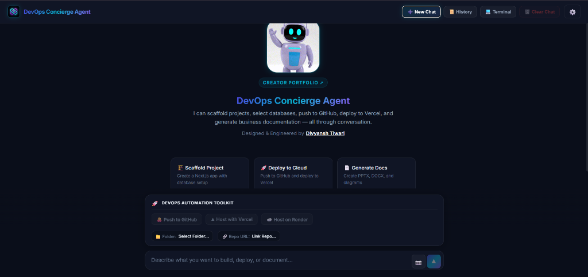
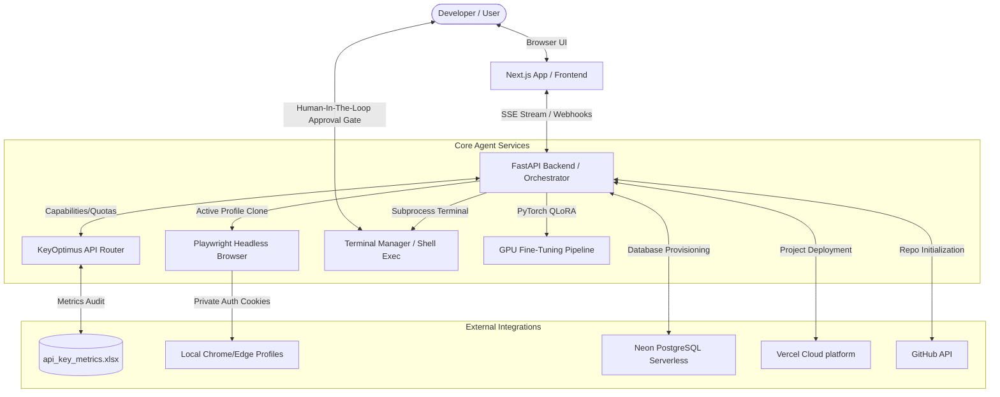
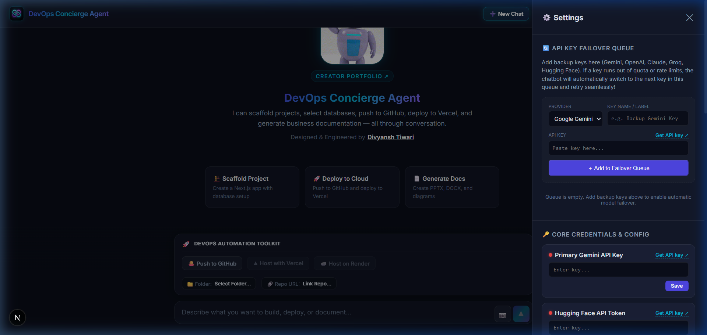

# 🤖 DevOps Concierge Agent

An enterprise-grade, highly resilient AI DevOps automation platform. Scaffold projects, provision cloud infrastructure, deploy to Vercel, orchestrate Kafka pipelines, and generate consulting-grade documentation through natural conversation.

<p align="center">
  
</p>

---

## 📌 Problem Statement & Core Value

### The DevOps Bottleneck
In modern software engineering, setting up a project is rarely just about writing code. Developers spend hours on boilerplate configuration, database provisioning, API key management, local pipeline setup, cloud environment syncing, and writing documentation. For non-experts, this creates a steep learning curve; for seniors, it represents tedious, repetitive overhead.

### Why Agents?
Static templates and traditional CLI tools cannot adapt to fluid, context-rich developer requirements. An **autonomous ReAct (Reasoning and Acting) Agent** uniquely solves this problem by acting as a virtual staff engineer:
* **Interactive Tool Use:** It inspects your local workspace, runs test commands, reads documentation, and fixes errors in-situ.
* **Service Orchestration:** It bridges disconnected cloud platforms (e.g., automatically spinning up databases on Neon and injecting credentials into Vercel).
* **Resilient Lifecycle Execution:** It handles complex, multi-stage workflows in the background while keeping the developer in full control via human-in-the-loop approval gates.

---

## 📐 System Architecture

The platform is engineered as a decoupled monorepo, optimized for fast local execution while supporting secure, production-grade cloud integrations.



### 1. KeyOptimus API Key Router & Optimizer Microservice
*   **Decoupled microservice (Port 8005):** A deterministic, zero-AI-token gateway managing your API keys.
*   **Capability-Aware Routing:** Routes simpler queries to lower-tier models (Groq Llama 3) and reserves premium keys (Gemini 2.5 Pro) for multimodal vision and document analysis.
*   **Utility Preservation:** Locks out simple text queries from premium keys once they drop below 5 remaining requests, ensuring those keys are saved for image or video generation.
*   **Metrics Logger:** Automatically tracks and writes latency, token usage, and status to a styled Excel sheet ([api_key_metrics.xlsx](api_key_metrics.xlsx)).
*   **Self-Healing Quarantine:** Quarantines failing or rate-limited keys for 5 minutes, allowing subsequent requests to load-balance to backup models.

### 2. Unified Resource Reader & Authenticated Scraping
*   **Zero-Downtime Browser Profile Cloning:** Inherits cookies and sessions from your active Google Chrome or Microsoft Edge profile. It generates a lightweight clone (<15MB) to bypass file locks and runs a headless browser via Playwright to read authenticated private dashboards.
*   **Multi-Format File Parser:** Natively parses Word (`.docx`), PowerPoint (`.pptx`), PDF (`.pdf`), and plain-text configuration files.

### 3. Automated Database & Cloud Provisioning
*   **Neon + Vercel Sync:** Automatically creates isolated serverless PostgreSQL databases on Neon and injects the credentials as `DATABASE_URL` directly into your Vercel project's environment variables.
*   **Intelligent GitHub Fallbacks:** If the target repository name already exists on your GitHub account, the agent gracefully bypasses creation errors and pushes updates directly to the existing repository instead of failing.
*   **Vercel Deployment Flexibility:** Enforces private repository creation by default, offering two deployment avenues:
    *   **Git-Backed Deployment (CI/CD):** Links Vercel directly to your GitHub repository. Includes built-in interactive links to authorize the Vercel GitHub App for private repositories if blocked.
    *   **Direct CLI Upload:** Direct folder deployment via Vercel CLI (`npx vercel`), bypassing GitHub App permissions entirely for seamless, instant, one-off deploys.
*   **Render Private Repository Connectors:** Detects private repository pull restrictions on Render deployments and automatically provides one-click authorization shortcuts.

### 4. GPU-Accelerated Local QLoRA Training
*   **Data Privacy & Autonomy:** Offline pipeline to fine-tune lightweight models (e.g., Qwen 2.5 Coder 1.5B/7B) on your local hardware using `bfloat16` precision to avoid PyTorch Automatic Mixed Precision (AMP) scaling overhead and out-of-memory crashes.

### 5. Secure Human-in-the-Loop Gateway
*   **Authorization Gates:** Safe terminal commands and project file mutations require explicit approval in the UI via action cards.

---

## 🖥️ User Interface Walkthrough

### Main Workspace
The main interface features a responsive sidebar containing conversation history, a central playground showcasing scaffolded cards, and an interactive input area.

<p align="center">
  
</p>

### Encrypted Settings Panel
Access the settings drawer to securely store environment tokens for Gemini, GitHub, Vercel, and Neon. Keys are encrypted at rest using Fernet symmetric cryptography.

<p align="center">
  
</p>

---

## 🚀 Quick Start

### 1. Prerequisites
Ensure you have **Python 3.10+** and **Node.js 18+** installed.

### 2. Install Project Dependencies
```bash
# Install backend Python requirements
pip install -r requirements.txt

# Install Playwright for authenticated browser scraping & PDF parsing
pip install playwright pypdf
playwright install chromium

# Install frontend Node dependencies
cd frontend
npm install
cd ..
```

### 3. Run the Platform
Double-click **`start.bat`** (or run it in your terminal) to boot the Next.js dev server, FastAPI agent backend, and KeyOptimus Scheduler microservice simultaneously:
```bash
.\start.bat
```

### 4. Setup Credentials
Open `http://localhost:3000` in your browser, open the **Settings (⚙️)** panel, and supply your API keys:
*   `GEMINI_API_KEY` (Primary LLM engine)
*   `VERCEL_TOKEN` & `GITHUB_TOKEN` (For automated deployments)
*   `NEON_API_KEY` (For database linking)

---

## 🔌 Model Context Protocol (MCP) Integration

The project exposes a zero-dependency Python stdio MCP server at [backend/agent/mcp_server.py](backend/agent/mcp_server.py) to securely serve DevOps skills to external clients:
*   `check_credentials`: Safely audits API key presence without exposing raw secrets.
*   `select_database`: Analyzes project prompts to recommend optimized database backends.

To configure the server in **Claude Desktop**, add this to your `%APPDATA%\Claude\claude_desktop_config.json`:
```json
{
  "mcpServers": {
    "devops-concierge": {
      "command": "python",
      "args": ["c:/Users/HP/DevOps-Concierge-Agent/backend/agent/mcp_server.py"]
    }
  }
}
```
